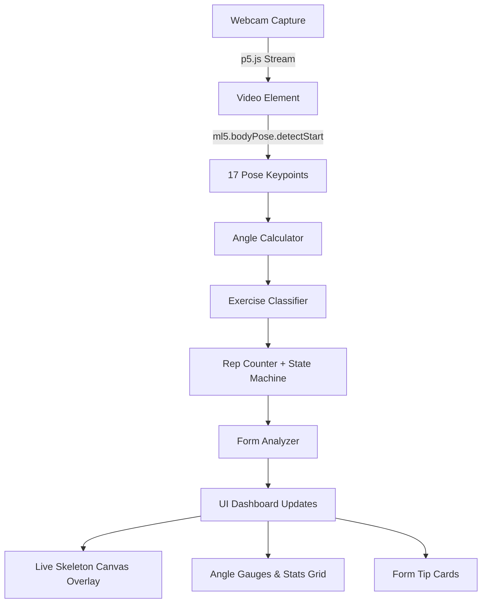

# 🏋️ FormSense AI — Smart Workout Form Coach

FormSense AI is a real-time, AI-powered workout form coach that runs entirely client-side in the browser. Using webcam body tracking, it detects exercises, counts reps, checks joint angles/alignment, and provides live form feedback—ensuring you perform every movement safely and effectively.

Designed with a premium glassmorphic dark-mode dashboard, it runs locally on your device with complete privacy.

---

## 🚀 Live Demo & Visuals

*(You can add a screenshot or video demo of your running application here!)*

### UI Dashboard Overview
```text
┌──────────────────────────────────────────────────────────────────┐
│  🏋️ FormSense AI — Smart Workout Coach          ● Model Ready   │
├────────────────────────────────────┬─────────────────────────────┤
│                                    │  📋 Exercise                │
│                                    │  [Squat][Push-up][Lunge]    │
│                                    │  [Plank][Yoga] [Auto]       │
│      ┌─────────────────────┐       │                             │
│      │                     │       │  🔢 Reps                    │
│      │   WEBCAM FEED       │       │      12                     │
│      │   + Skeleton        │       │                             │
│      │   + Angle Arcs      │       │  📊 Form Score              │
│      │   + Form Feedback   │       │   ╭──────╮                  │
│      │                     │       │   │  87% │  ← gauge         │
│      │                     │       │   ╰──────╯                  │
│      └─────────────────────┘       │                             │
│                                    │  📐 Key Angles              │
│                                    │  L Knee: 92° ████░░ 🟢      │
│                                    │  R Knee: 88° ████░░ 🟢      │
│                                    │  L Hip:  85° ███░░░ 🟡      │
│                                    │                             │
│                                    │  💡 Form Tips               │
│                                    │  ┌───────────────────────┐  │
│                                    │  │ ✅ Good depth!        │  │
│                                    │  │ ⚠️ Keep back straight │  │
│                                    │  └───────────────────────┘  │
├────────────────────────────────────┴─────────────────────────────┤
│  ⏱ 04:32  │  Total Reps: 47  │  Avg Score: 82%  │  🔥 Streak: 5  │
└──────────────────────────────────────────────────────────────────┘
```

---

## ✨ Features

- **Real-Time Pose Tracking**: Utilizes **ml5.js v1.x** with the **MoveNet** model (17 keypoints) for ultra-low latency pose estimation.
- **Dynamic Skeleton Overlay**: Renders interactive skeletal joints on a **p5.js** canvas, color-coded by performance (🟢 Good, 🟡 Warning, 🔴 Action Required).
- **Interactive Angle Visualizer**: Draws joint angle arcs directly on the skeletal visualization so you can see your body alignment visually.
- **Smart Rep Counter**: Powered by a finite state-machine which detects transition phases (e.g., UP → DOWN → UP) to ensure accurate rep tracking.
- **Continuous Hold Timers**: Automatically tracks hold durations for static exercises like Planks and Yoga poses.
- **Multi-Exercise Support**:
  - 🏋️ **Squats**: Detects depth, monitors back angle, and tracks knee-over-toe alignment.
  - 💪 **Push-ups**: Ensures full range of motion and warns about sagging or piking hips.
  - 🦵 **Lunges**: Monitors torso posture and knee positioning.
  - 🧘 **Plank**: Measures alignment of shoulder-hip-ankle.
  - 🙏 **Yoga (Tree Pose / Warrior)**: Validates balance, posture hold, and alignment scores.
  - 🤖 **Auto Mode**: Uses heuristics to automatically identify which exercise you are performing.
- **Sleek UI/UX**: Premium glassmorphic design featuring neon cyan, green, orange, and red indicators, live progress gauges, stats grids, and active tip cards.
- **100% Client-Side & Private**: Your video stream never leaves your browser. All pose detection and mathematical calculations are done locally.

---

## 🏗️ Architecture

The pipeline processes webcam video frames sequentially in the browser:



---

## 🛠️ Tech Stack

| Component | Technology | Description |
| :--- | :--- | :--- |
| **ML Engine** | **ml5.js v1.x** | MoveNet model for fast and accurate keypoint estimation |
| **Canvas & Video** | **p5.js v1.4.0** | Webcam management, image rendering, and visual overlay overlays |
| **Frontend UI** | **HTML5 / CSS3 / ES6** | Modern layout using CSS Grid, Flexbox, custom variables, and Glassmorphism |
| **Math & Logic** | **Vanilla JS** | Joint angle calculators, state machine, and form rule heuristics |

---

## 📂 Project Structure

```text
Yoga/
├── index.html          # Main HTML structure, model configurations, and script tags
├── style.css           # Premium glassmorphic style system, animations, responsive design
├── sketch.js           # p5.js drawing setup, canvas loop, and keypoint drawing
├── poseEngine.js       # Core math, angle calculators, rules, states, and form metrics
├── ui.js               # Event bindings, DOM updates, sidebar statistics, and history logs
└── README.md           # Documentation
```

---

## 🚀 Getting Started

Since FormSense AI is built entirely on standard Web standards, you do not need to install any compilers or backend packages.

### Option 1: Live Server (Recommended)
To run with your webcam properly active, it's best to serve it using a local HTTP server:
1. Open the folder in **VS Code**.
2. Install the **Live Server** extension.
3. Click the **Go Live** button in the bottom right corner of the window.
4. Allow camera permissions when prompted.

### Option 2: Python HTTP Server
If you have Python installed, you can start a simple server from the workspace root:
```bash
# Python 3
python -m http.server 8000
```
Then navigate to `http://localhost:8000` in your web browser.

### Option 3: Node.js (http-server)
If you have Node.js installed, you can use:
```bash
npx http-server .
```

---

## 📐 How It Works (Example: Joint Angle Calculation)

Joint angles are computed in 2D space using trigonometric functions on the x and y coordinates of three consecutive keypoints (e.g., *Hip* → *Knee* → *Ankle* for knee flexion):

```javascript
function getAngle(A, B, C) {
  // Returns angle at point B formed by points A-B-C
  const radians = Math.atan2(C.y - B.y, C.x - B.x) 
                - Math.atan2(A.y - B.y, A.x - B.x);
  let angle = Math.abs(radians * 180 / Math.PI);
  if (angle > 180) angle = 360 - angle;
  return angle;
}
```

These angles are checked against target thresholds dynamically to increment reps or prompt warnings. For example, during a **Squat**, a rep transition is detected when:
- **Starting position (UP)**: Knee and Hip angles > 160°
- **Lowest position (DOWN)**: Knee and Hip angles < 100°

---

## 🤝 Contributing

Contributions are welcome! Please open an issue or submit a pull request if you have ideas for adding new exercises, improving pose classification heuristics, or enhancing the visual feedback dashboard.