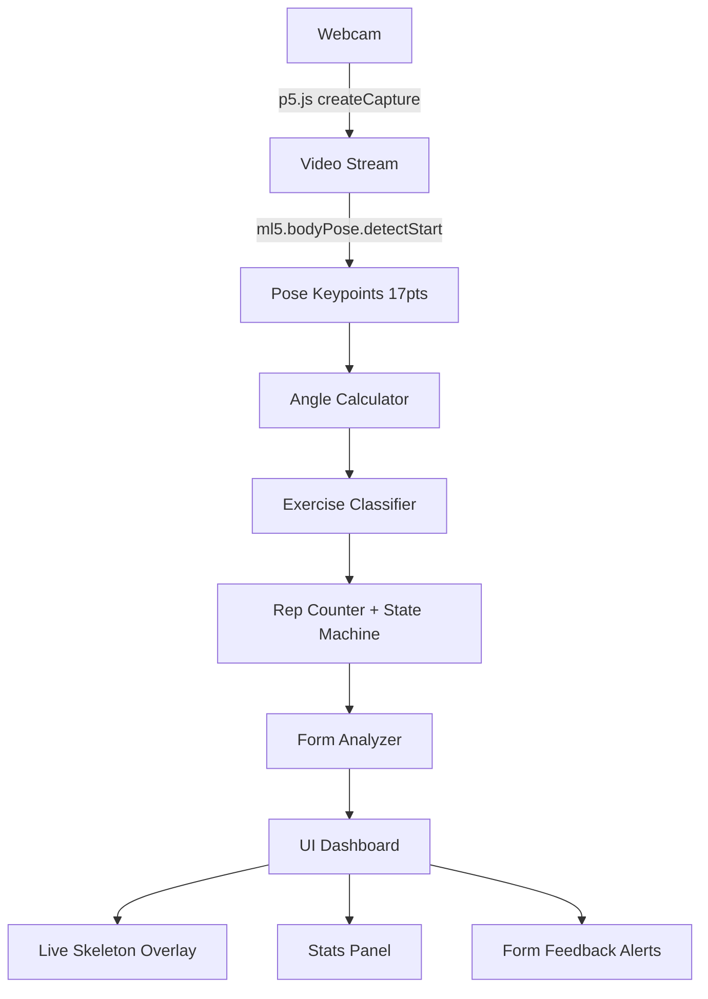

# Smart Workout Form Coach

Build a real-time AI workout form coach that uses webcam body tracking to detect exercises, count reps, check joint angles/alignment, and provide live form feedback — all running client-side in the browser.

## Tech Stack

| Layer | Technology |
|-------|-----------|
| ML/Pose Detection | **ml5.js v1.x** — `ml5.bodyPose("MoveNet")` (17 keypoints) |
| Canvas/Video | **p5.js v1.4** — webcam capture, skeleton rendering |
| UI | **Vanilla HTML/CSS/JS** — glassmorphic dark-mode dashboard |
| Hosting | Static files — no backend needed |

## Architecture Overview



## Proposed Changes

### File Structure

```
Yoga/
├── index.html          [MODIFY] — Complete rebuild with premium UI
├── style.css           [NEW]    — Glassmorphic dark-mode design system
├── sketch.js           [MODIFY] — p5.js setup + rendering loop
├── poseEngine.js       [NEW]    — Angle math + exercise classification
└── ui.js               [NEW]    — DOM-based UI updates (stats, feedback)
```

---

### [MODIFY] [index.html](file:///c:/Users/Shubham%20Renuke/OneDrive/Desktop/Yoga/index.html)

Complete rebuild:
- Upgrade to **ml5.js v1.x** (`https://unpkg.com/ml5@1/dist/ml5.js`)
- Keep **p5.js v1.4** 
- Add `style.css`, `poseEngine.js`, `ui.js` script/link tags
- Premium dark UI layout:
  - **Left**: p5.js canvas with skeleton overlay (webcam feed)
  - **Right sidebar**: Exercise selector, live stats (reps, angle gauges, timer), form feedback cards
  - **Top bar**: App title + model loading indicator
  - **Bottom**: Session summary bar

---

### [NEW] [style.css](file:///c:/Users/Shubham%20Renuke/OneDrive/Desktop/Yoga/style.css)

Premium glassmorphic dark-mode design system:
- Dark background with subtle gradient (`#0a0a1a` → `#1a1a3e`)
- Glassmorphism cards: `backdrop-filter: blur(16px)`, semi-transparent backgrounds
- Google Font: **Inter** for clean readability
- Neon accent colors: cyan (`#00f0ff`), green (`#00ff88`), warning orange, error red
- Smooth CSS transitions and micro-animations on stat changes
- Responsive layout with CSS Grid (canvas + sidebar)
- Animated circular gauge for joint angles
- Pulse animations for rep count changes

---

### [MODIFY] [sketch.js](file:///c:/Users/Shubham%20Renuke/OneDrive/Desktop/Yoga/sketch.js)

Complete rewrite using ml5.js v1.x API:

```javascript
// Key changes:
// 1. preload() — ml5.bodyPose("MoveNet") 
// 2. setup()   — createCanvas, createCapture, bodyPose.detectStart()
// 3. draw()    — render video + skeleton overlay with color-coded joints
// 4. gotPoses() — feed results to poseEngine for analysis
```

**Skeleton rendering features:**
- Color-coded joints: green (good form), yellow (warning), red (bad form)
- Skeleton lines with gradient colors based on alignment quality
- Confidence threshold filtering (>0.3)
- Joint angle arc visualizations drawn at key joints
- Exercise name + rep count overlay on canvas

---

### [NEW] [poseEngine.js](file:///c:/Users/Shubham%20Renuke/OneDrive/Desktop/Yoga/poseEngine.js)

Core intelligence module — exercise detection, angle math, form checking.

#### Angle Calculation
```javascript
function getAngle(A, B, C) {
  // Returns angle at point B formed by points A-B-C
  // Uses atan2 for full 360° precision
  const radians = Math.atan2(C.y - B.y, C.x - B.x) 
                - Math.atan2(A.y - B.y, A.x - B.x);
  let angle = Math.abs(radians * 180 / Math.PI);
  if (angle > 180) angle = 360 - angle;
  return angle;
}
```

#### Key Joint Angles Tracked

| Angle Name | Keypoints (A → B → C) | Used For |
|-----------|----------------------|----------|
| Left Knee | left_hip → left_knee → left_ankle | Squats, Lunges |
| Right Knee | right_hip → right_knee → right_ankle | Squats, Lunges |
| Left Hip | left_shoulder → left_hip → left_knee | Squats, Planks |
| Right Hip | right_shoulder → right_hip → right_knee | Squats, Planks |
| Left Elbow | left_shoulder → left_elbow → left_wrist | Push-ups |
| Right Elbow | right_shoulder → right_elbow → right_wrist | Push-ups |
| Left Shoulder | left_elbow → left_shoulder → left_hip | Yoga (Warrior, Tree) |
| Right Shoulder | right_elbow → right_shoulder → right_hip | Yoga (Warrior, Tree) |

#### Exercise Classification (State Machine)

Each exercise uses a finite state machine with angle thresholds:

**1. Squats**
- **DOWN state**: Both knees < 100° AND hips < 100°
- **UP state**: Both knees > 160° AND hips > 160°  
- **Rep**: UP → DOWN → UP transition
- **Form checks**: Knees over toes (x-alignment), back straight (shoulder-hip-knee alignment), depth sufficient

**2. Push-ups**
- **DOWN state**: Both elbows < 90°
- **UP state**: Both elbows > 160°
- **Rep**: UP → DOWN → UP
- **Form checks**: Body straight (shoulder-hip-ankle alignment ~170-180°), full range of motion

**3. Lunges**
- **DOWN state**: Front knee < 100° AND back knee < 100°
- **UP state**: Both knees > 150°
- **Rep**: UP → DOWN → UP
- **Form checks**: Front knee doesn't pass toes, torso upright

**4. Plank (Hold)**
- **HOLD state**: Hip angle 160-180° AND elbow angle 160-180° (high plank) or 80-100° (low plank)
- **No reps** — tracks hold duration in seconds
- **Form checks**: Hip sag (hip drops below line), pike (hip rises too high)

**5. Yoga Poses (Hold)**
- **Warrior I/II**: Front knee ~90°, arms raised (shoulder angles)
- **Tree Pose**: One leg lifted (knee high, ankle near inner thigh), arms up
- **Detected via** combined angle + keypoint position heuristics
- **No reps** — tracks hold duration + alignment score

#### Form Scoring
- Each frame gets a form score (0-100%) based on how close angles are to ideal
- Running average over last 30 frames for stability
- Feedback messages: "Great form!", "Bend knees deeper", "Keep back straight", "Don't let hips sag", etc.

---

### [NEW] [ui.js](file:///c:/Users/Shubham%20Renuke/OneDrive/Desktop/Yoga/ui.js)

DOM manipulation for the stats dashboard:
- **Exercise selector**: Button group to pick current exercise (or auto-detect mode)
- **Rep counter**: Large animated number with pulse effect on increment
- **Form score**: Circular progress gauge (0-100%)  
- **Angle readouts**: Live values for key angles relevant to current exercise
- **Feedback cards**: Color-coded tips that slide in/out based on form analysis
- **Session timer**: Elapsed workout time
- **Hold timer**: For planks/yoga — shows seconds held
- **History log**: Scrollable list of completed sets

---

## MoveNet Keypoint Reference (17 points)

```
 0: nose
 1: left_eye        2: right_eye
 3: left_ear        4: right_ear
 5: left_shoulder   6: right_shoulder
 7: left_elbow      8: right_elbow
 9: left_wrist     10: right_wrist
11: left_hip       12: right_hip
13: left_knee      14: right_knee
15: left_ankle     16: right_ankle
```

## UI Design Mockup Description

```
┌──────────────────────────────────────────────────────────────────┐
│  🏋️ FormSense AI — Smart Workout Coach          ● Model Ready   │
├────────────────────────────────────┬─────────────────────────────┤
│                                    │  📋 Exercise                │
│                                    │  [Squat][Push-up][Lunge]    │
│                                    │  [Plank][Yoga] [Auto]       │
│      ┌─────────────────────┐       │                             │
│      │                     │       │  🔢 Reps                    │
│      │   WEBCAM FEED       │       │      12                     │
│      │   + Skeleton        │       │                             │
│      │   + Angle Arcs      │       │  📊 Form Score              │
│      │   + Form Feedback   │       │   ╭──────╮                  │
│      │                     │       │   │  87% │  ← gauge         │
│      └─────────────────────┘       │   ╰──────╯                  │
│                                    │                             │
│                                    │  📐 Key Angles              │
│                                    │  L Knee: 92° ████░░ 🟢      │
│                                    │  R Knee: 88° ████░░ 🟢      │
│                                    │  L Hip:  85° ███░░░ 🟡      │
│                                    │                             │
│                                    │  💡 Form Tips               │
│                                    │  ┌───────────────────────┐  │
│                                    │  │ ✅ Good depth!        │  │
│                                    │  │ ⚠️ Keep back straight │  │
│                                    │  └───────────────────────┘  │
├────────────────────────────────────┴─────────────────────────────┤
│  ⏱ 04:32  │  Total Reps: 47  │  Avg Score: 82%  │  🔥 Streak:5 │
└──────────────────────────────────────────────────────────────────┘
```

## Verification Plan

### Automated Tests
- Open the app in the browser using the browser tool
- Verify model loads without errors (console check)
- Verify webcam stream initializes
- Verify skeleton overlay renders on the canvas
- Test exercise selection buttons update UI state

### Manual Verification
- Perform exercises in front of the webcam and observe:
  - Joint angles update in real-time
  - Rep counter increments correctly
  - Form feedback changes based on body position
  - Hold timer works for plank/yoga
- Verify responsive layout at different window sizes

> [!IMPORTANT]
> The app runs entirely client-side — no backend, no API keys, no build step needed. Just open `index.html` in a browser with webcam access.

> [!NOTE]  
> MoveNet is chosen over BlazePose for better performance (fewer keypoints = faster inference). The 17-keypoint model is sufficient for all supported exercises.
